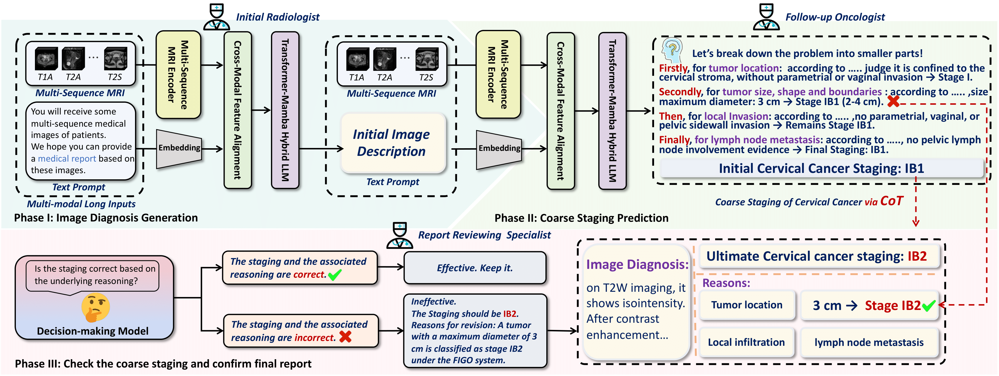
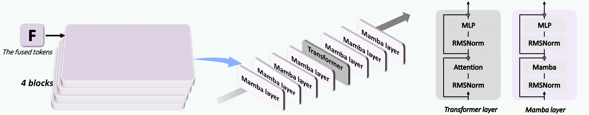

<p align="center">
   📃 <a href="https://papers.miccai.org/miccai-2025/paper/0177_paper.pdf" target="_blank">Paper</a> • 🌐 <a href="" target="_blank"></a> 
</p>


## 🌈 Update

<!-- * **[2025.12.12]** [LongLLaVA-53B-A13B](https://huggingface.co/FreedomIntelligence/LongLLaVA-53B-A13B), [LongLLaVA-9b](https://huggingface.co/FreedomIntelligence/LongLLaVA-9B) and [Jamba-9B-Instruct](https://huggingface.co/FreedomIntelligence/Jamba-9B-Instruct) are repleased！🎉  -->
* **[2025.12.05]** Cervical-RG repo is published！🎉


## Architecture

<details>
  <summary>Click to view the architecture image</summary>

  
  

</details>


## Results reproduction

### 1. Environment Setup

  ```bash
  pip install -r requirements.txt
  ```

- Dataset DownLoading and Construction
  > Coming Soon.

### 2. Training

- Downloading Language Models
  <p align="left">
   🤗 <a href="https://huggingface.co/FreedomIntelligence/LongLLaVAMed-9B" target="_blank">LongLLaVAMed-9B</a> 
  </p>

- 
  ```bash
  bash 3DImageSFT.sh
  ```

### 4. Evaluation

- Command Line Interface

```bash
python Cervical-RG/llava/eval/model_vqa.py
```

## TO DO

- [ ] Release Data Construction Code

## Acknowledgement

- [LLaVA](https://github.com/haotian-liu/LLaVA): Visual Instruction Tuning (LLaVA) built towards GPT-4V level capabilities and beyond.
- [LongLLaVA](https://github.com/FreedomIntelligence/LongLLaVA): LongLLaVA: Scaling Multi-modal LLMs to 1000 Images Efficiently via Hybrid Architecture.
## Citation

```
@misc{
      @InProceedings{ZhaHan_CervicalRG_MICCAI2025,
        author = { Zhang, Hanwen AND Long, Yu AND Fan, Yimeng AND Wang, Yu AND Zhan, Zhaoyi AND Wang, Sen AND Jiang, Yuncheng AND Sun, Rui AND Xing, Zheng AND Li, Zhen AND Duan, Xiaohui AND Zhao, Weibing},
        title = { { Cervical-RG: Automated Cervical Cancer Report Generation from 3D Multi-sequence MRI via CoT-guided Hierarchical Experts } },
        booktitle = {proceedings of Medical Image Computing and Computer Assisted Intervention -- MICCAI 2025},
        year = {2025},
        publisher = {Springer Nature Switzerland},
        volume = {LNCS 15964},
        month = {September},
        page = {78 -- 88}
    },
}
```
